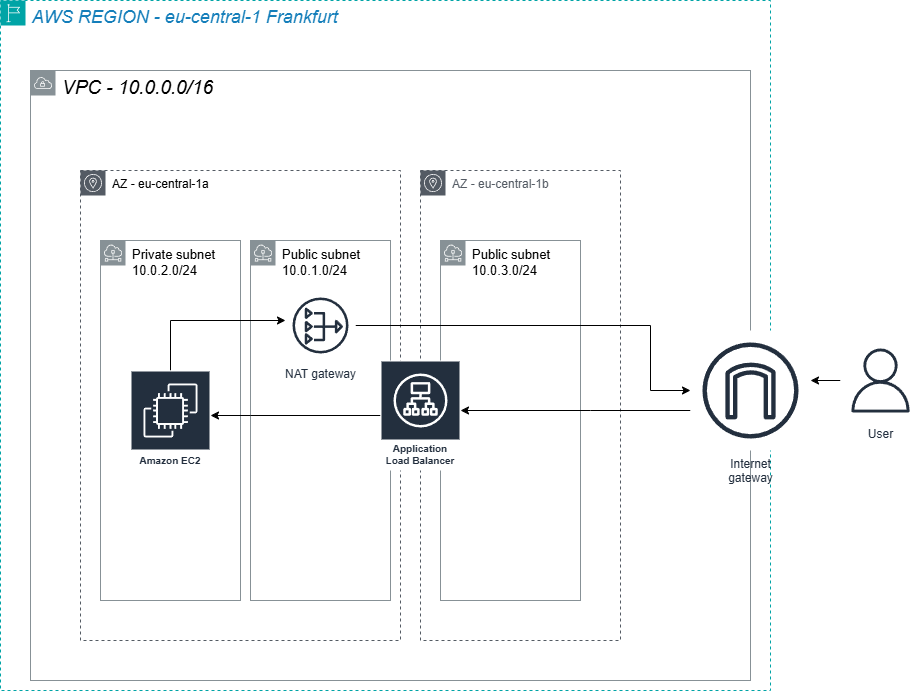

# aws-aplication-load-balancer-web-architecture
building a highly available and secure web architecture in AWS using ALB and Private Subnets

About project

Get experience with AWS networking and security. My main goal was to answer a common infrastructure question: "How do I serve a website to the public internet without actually exposing my web servers to hackers?"
To solve this, I designed a multi-tier VPC architecture where the Application Load Balancer (ALB) sits in the public subnet to handle incoming traffic, while the actual Apache web server is safely isolated in a private subnet with no public IP address.

## Architecture Design

## Tech Stack
**Networking:** Amazon VPC, Internet Gateway, NAT Gateway, Route Tables.
**Compute & Routing:** Amazon EC2 (Amazon Linux 2023), Application Load Balancer (ALB), Target Groups.
**Security:** AWS IAM (Roles for SSM), strictly chained Security Groups.
**Management:** AWS Systems Manager (SSM) Session Manager (Used for secure, keyless terminal access).

## Setup Process

1. Created a custom VPC (10.0.0.0/16) with public and private subnets across two different Availability Zones to ensure high availability for the Load Balancer.
